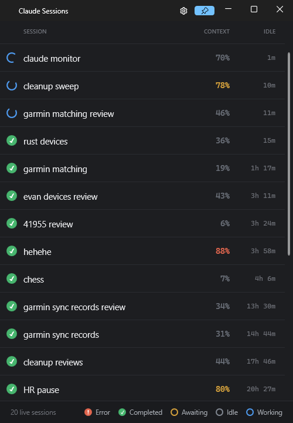

# ClaudeSessionMonitor

A Windows tray app that lists every **live local Claude Code and Codex CLI session** at a glance, lets
you jump to one, and restores them after a reboot. It reads each CLI's on-disk state — no configuration
is required to *see* sessions (Claude's `~/.claude/sessions/<pid>.json` live registry, and `~/.codex`'s
rollout logs).

.NET 10 · WPF + [WPF-UI](https://github.com/lepoco/wpfui) (Fluent / Mica).

## The window
A compact ~500px card, **sorted attention-first** (Error → Awaiting → Working → Completed → Idle),
then **most-recently-changed first within each group**, re-sorting live as states change:

| Glyph | State | Claude status | Meaning |
|---|---|---|---|
| 🔴 red disc + ! | **Error** | *(transcript)* | last turn hit an API error (rate-limit, etc.) — hover the row for the message |
| 🟠 amber pulsing ring | **Awaiting** | `waiting` | blocked on you (permission / input) |
| 🔵 blue spinner | **Working** | `busy` / `shell` | actively running — including background shell/lane work while the agent "holds" |
| 🟢 green disc + ✓ | **Completed** | `idle` | finished its turn, ready for you |
| ⚪ slate ring | **Idle** | *(other)* | fallback for any unrecognized status |

**Error** is read from the transcript (a synthetic `isApiErrorMessage` turn), not the registry — which
still reports `idle` — and it clears itself when the session's next real turn lands.

Each row shows the session **name**, a **model pill**, the **Context %** (colored by fullness: amber >
70, red > 85 — matching the omc status-line thresholds), and **Idle** time humanized (`42m`, `1h 5m`).

The **model pill** carries a colored provider mark plus the short model name — **✳ Opus 5**, **✳ Fable
5**, **✳ Opus 4.8** (clay = Claude Code) or **◆ Sol** (green = Codex). Codex also reports a **reasoning
effort**, which trails the model in dimmer text (**◆ Sol ultra**); Claude Code doesn't record one in its
transcript, so Claude pills show the model alone. Hover the pill for the full model id.

**Hover a row's Idle column** for the rest — model, context tokens, status, last tool, folder,
provider/PID/Id/version (and the API-error text when it's in that state). Sessions whose terminal sits on a **different
virtual desktop** get a small colored pip at the row's left edge — one color per desktop, the
current desktop shows none (hover it for "Desktop N"). A session running **subagents** shows a small
**⚙ N** badge after its name — how many are working right now (hover for the total spawned this
session); its slot is reserved on every row, so the model pills stay in a straight column whether or
not agents are running. A footer shows the live count (hover for the Claude/Codex split) and a color
legend.

Below that, the **usage bar**: the signed-in Claude account on the left, and one fill-behind meter per
plan limit on the right — the Claude ones (**5h**, **Week**, and any model-scoped limit), then
**Codex**. Hover any meter for what it is, when it resets, and — for Codex — the plan and how old the
reading is.

The **title bar** holds a **settings** gear (opens the Settings window) and an **always-on-top pin**
(accents when active), beside the min/max/close buttons. The Dark/Light Fluent theme is chosen in
Settings and remembered.

A **new-session launcher** floats over the lower right of the session list, one row per CLI, each led
by its provider mark. In both rows the left group opens a **new window** and the right group a **new
tab** in the terminal you used last; each appends that CLI's flags from Settings.

- **✳ Claude** — four buttons: plain and named in each group (the **rename** icon prompts first and
  passes `--name`).
- **◆ Codex** — two buttons, plain only. `codex` has **no name argument** — it rejects one outright —
  because a Codex thread is named from inside the TUI once it's running, so the named variants have no
  Codex equivalent.

## Columns
The four columns above are the default. **Right-click any column header** to show/hide extra fields
(raw Status, PID, Id, context tokens, Last Tool, CWD, Version). Column visibility, order, and width
are all remembered.

## Docking
Right-click the tray icon → **Dock to** → an edge or corner, and the window **snaps there on the
monitor it's currently on** (multi-monitor aware). Edges become a full-height sidebar (pair with the
pin to keep it above other windows; drag the inner border to set the width). It's a **one-shot snap** —
the window's position/size is remembered on close, so it reopens where you left it; there's no sticky
"dock mode" or re-snapping. It floats over other windows (doesn't *reserve* space).

## Behavior
- **System tray** — double-click the tray icon to open; closing the window hides it back to the tray.
  Right-click for the (Fluent) menu: **Open**, **Settings…**, **Restore sessions…**, **Toggle theme**,
  **Dock to** (edge/corner), and **Exit**.
- **Double-click a row** → bring that session's terminal window + tab to the foreground. Rows
  highlight on hover (with a hand cursor) to show they're clickable.
- **Ctrl + mouse wheel** zooms the content larger/smaller (like browser zoom) without resizing the
  window; **Ctrl + 0** resets to 100%. Remembered.
- **Change-driven refresh** — a `FileSystemWatcher` on the sessions registry updates the list within
  ~120ms of a status change, with a 2s fallback poll. Event-driven, so idle CPU is ~0 — no hooks, no
  config changes.
- Settings persist to `%APPDATA%\ClaudeSessionMonitor\settings.json`; unhandled errors are logged to
  `%TEMP%\claude-session-monitor-error.log`.
- `--list` / `--windows` headless modes dump the session list / focus mapping to `%TEMP%`.

## Install & updates
The released exe is **self-installing**. Run it once from anywhere and it copies itself to
**`%LOCALAPPDATA%\Programs\ClaudeSessionMonitor\`** (per-user — no admin), drops a Start Menu
shortcut, and relaunches from there. That per-user location is the whole trick to **seamless
auto-update**: the app can rewrite its own exe without a UAC prompt.

Once installed it checks GitHub Releases in the background — on launch, every 30 minutes, and whenever
you open the window, so the button is there when you'd actually look for it (repeated opens are
debounced so they can't respawn `gh`). Auth goes through the **`gh` CLI**, so it works against the
private repo with **no token baked into the app**.
When a newer release is found it silently downloads + stages it, then a **↻ button appears in the
title bar**. Click it to restart into the new version — near-instant, since all state (settings,
window position, columns, the live list) is already on disk. If a freshly-updated build crash-loops
on startup, it automatically **rolls back** to the previous exe.

Auto-update is dormant unless the app runs from its install dir, so a `bin\` dev build never
self-installs or self-updates. (Test hooks: `CSM_INSTALL_DIR` redirects the install dir,
`CSM_NO_INSTALL=1` skips self-install, `CSM_FAKE_UPDATE=<tag>` forces the update button.)

## Session restore
The app keeps `%APPDATA%\ClaudeSessionMonitor\active-sessions.json` in sync with the live interactive
sessions of **both** CLIs (snapshot-on-change). If the machine crashes or reboots, that file still holds
whatever was running — so on the next launch the app offers a **restore picker**: a checklist of the
sessions that were running but aren't now, each marked with its provider, reopening the selected ones in
new Windows Terminal windows in their original folders:

| | Reopened with |
|---|---|
| **✳ Claude** | `claude --resume <id> --name <name>` |
| **◆ Codex** | `codex resume <id>` — no `--name`, because on Codex's side the name already belongs to the thread |

Also available any time from the tray (**Restore sessions…**).

Only sessions **you were sitting in front of** are recorded: Claude's `interactive` kind and Codex's TUI.
A `codex exec` thread is a headless one-shot fired by a script or an agent, so reopening one in a terminal
would restart somebody's automation rather than restore your work.

**Settings** — from the title-bar gear or the tray (**Settings…**) — holds the **theme** (Dark/Light),
**Show in taskbar** (turn off to live in the tray only), **Run at login** (on by default; registers the
installed exe under `HKCU\...\CurrentVersion\Run` — dev builds never touch it), and a flags box **per CLI**:
**Claude flags** appended to every new or resumed Claude session (e.g. `--dangerously-skip-permissions`)
and **Codex flags** appended to every resumed Codex one (e.g. `--dangerously-bypass-approvals-and-sandbox`).
They're separate because the two CLIs share no flag spelling — one field for both would hand `codex` an
argument it exits on.

## Build / run
Requires .NET SDK 10.

    dotnet build -c Release
    bin\Release\net10.0-windows\ClaudeSessionMonitor.exe

To produce a distributable single `.exe` (self-contained, no .NET install needed, ~74 MB):

    dotnet publish ClaudeSessionMonitor.csproj -c Release -r win-x64 --self-contained true `
      -p:PublishSingleFile=true -p:IncludeNativeLibrariesForSelfExtract=true `
      -p:EnableCompressionInSingleFile=true -o bin\publish

(Drop `--self-contained true` for a ~6.5 MB build that needs the .NET 10 Desktop Runtime installed.)

## Releasing
Releases are **manual** (never on push). Go to **Actions → Release → Run workflow**, enter a tag
(e.g. `v1.0.0`), and run it — it publishes the self-contained `.exe`, signs it (if a cert is
configured), and attaches it to a new GitHub Release. See `.github/workflows/release.yml`.

**Signing / SmartScreen:** the exe ships **unsigned** until a code-signing cert is wired up. To sign,
add secrets `SIGNING_CERT_BASE64` (base64 of a `.pfx`) and `SIGNING_CERT_PASSWORD` — signing then runs
automatically. To remove the SmartScreen *"unknown publisher"* warning **immediately** you need a
**trusted** cert (EV, Azure Trusted Signing, or one that already has reputation); a plain OV cert signs
the file but may still warn until reputation builds. For a cloud/HSM cert (Azure Trusted Signing,
DigiCert KeyLocker), swap the workflow's *Sign the exe* step for that provider's action.

## How it works

### Claude Code
- **Discovery:** `~/.claude/sessions/<PID>.json` — one heartbeat file per live session, validated
  against a live process whose name starts with `claude` (tolerates Claude Code's self-update renaming
  the running `claude.exe` → `claude.exe.old.<ts>`, while still guarding against PID reuse). `status`
  is one of `busy`, `idle`, `waiting`, `shell`.
- **Detail:** tails `~/.claude/projects/<slug>/<sessionId>.jsonl` for token usage, model, last tool,
  and the Claude-set title — but only re-reads a transcript when its mtime/size changed since the last
  scan (an unchanged, idle session costs just a `stat`).
- **Refresh:** a `FileSystemWatcher` on `~/.claude/sessions/` fires when Claude rewrites a `<pid>.json`
  (status change / heartbeat) → a debounced re-scan; a 2s timer is the fallback. Event-driven, so idle
  CPU is ~0, with no hooks or edits to the user's files.
- **Focus:** finds the session's host process (parent-process-tree walk), enumerates that process's
  top-level windows, then uses UI Automation to find the *tab* whose title matches the session —
  across all those windows — selects that tab, foregrounds its window, and finally moves keyboard focus
  into the terminal pane so you can type straight away (selecting a tab alone leaves focus on the tab
  header). Needed because Windows Terminal spreads tabs across several windows under one process, so
  `Process.MainWindowHandle` can't identify the right one. (`--windows` dumps the mapping.)

### Codex
Codex publishes **no live registry** — there's only an append-only rollout log per thread at
`~/.codex/sessions/YYYY/MM/DD/rollout-<ts>-<id>.jsonl`. And `codex resume` **appends to the original
file**, so the filename, the day folder, and the mtime all lie about what's running now: the thread you
started last week can be the one live in front of you.

- **Discovery / liveness:** a running Codex holds its rollout file **open**, so the app asks the OS who
  that is — the **Restart Manager** API (`RmGetList`, the same non-admin call installers use for "close
  these apps first"), which returns the owning `codex.exe` PID. That's also what gives Codex rows a real
  PID, so double-click-to-focus works exactly as it does for Claude. The call costs ~50ms, so it runs on
  a budgeted background thread; the UI scan just reads the resulting map.
- **Detail:** `turn_context` → model + reasoning effort · `token_count` → context tokens and the model's
  own context window (so Codex rows are a percentage of *their* window, not the Claude default) ·
  `task_started` / `task_complete` → Working / Completed · tool calls → last tool.
- **Plan usage:** `rate_limits`, which Codex stamps onto **every** `token_count` record — so the Codex
  meter costs no API call, no credentials, and no cache to second-guess (the Claude meter needs all
  three). Read from live sessions as they run, and seeded at startup from the most recent rollout so
  the number is there before you start a Codex session, not after. Codex reports no severity of its
  own, so the pill's color uses the same 70/85 thresholds as Context %.
- **Names:** `~/.codex/session_index.jsonl`, falling back to the session's first message.
- **Subagents:** each Codex subagent is a rollout of its own, tied to its session by the header's
  `session_id` (which is the **root** thread at any nesting depth), and rolled up into the same **⚙ N**
  badge Claude's Task agents use.
- **Refresh:** the 2s poll, deliberately without a `FileSystemWatcher` — Codex writes to the rollout tree
  continuously while a turn runs, and every one of those events would trigger a re-read.

## Project layout
- `Program.cs` — entry point (single-instance; `--list` / `--windows` headless modes).
- `App.cs` — WPF application shell, the (WPF) tray icon + menu, and the theme-palette swap.
- `SessionsWindow.xaml` / `.xaml.cs` — the Fluent window (status-glyph template, grid, title-bar
  controls, live sort, header-right-click column menu).
- `SessionScanner.cs` — reads the registry and enriches each session from its transcript (mtime-cached).
- `CodexScanner.cs` — the same job for `~/.codex`, where liveness has to be derived rather than read.
- `FileHolders.cs` — "which process has this file open?" via Restart Manager (how Codex liveness is answered).
- `SessionInfo.cs` — data model. `SessionRow.cs` — observable row VM (derives the display state).
- `SessionState.cs` — the display states (incl. **Error**) + the Claude-status → state mapping.
- `WindowActivator.cs` / `Native.cs` / `TabSelector.cs` — focus + Windows Terminal tab selection.
- `VirtualDesktop.cs` — which virtual desktop a window is on (drives the per-row desktop pip).
- `Installer.cs` / `Updater.cs` — per-user self-install to LocalAppData + `gh`-based auto-update.
- `Themes/Dark.xaml`, `Themes/Light.xaml` — design-token brushes, swapped on theme toggle.
- `SessionRegistry.cs` / `SavedSession.cs` — persist the live set for crash/reboot restore.
- `SessionLauncher.cs` — reopen a session (`wt … claude --resume …`).
- `RestoreWindow.xaml` / `.xaml.cs` — restore picker. `SettingsWindow.xaml` / `.xaml.cs` — settings dialog.
- `app.ico` — coral starburst app/tray icon.
- `Settings.cs`, `Converters.cs`.

## Known limitations
- **`idle` shows as green "Completed".** Claude has no "done" status — an idle session has finished
  its turn and is ready for you, so it gets the green glyph. The pulsing **amber Awaiting** is the
  one that means "blocked on you."
- **Focus matches by tab title** — relies on each session having a distinct title (`/rename` or
  Claude's auto-title). Identical/empty titles may be ambiguous; it then falls back to a window-title
  match and refuses to focus the wrong window rather than guess.
- **Context % is approximate for Claude:** the true per-session context-window size is only handed to
  Claude Code *statusline* commands, not to a standalone app — so it's computed against a fixed **1M**
  (the max-context model these sessions always run). Codex rows are exact, because Codex writes
  `model_context_window` into every rollout.
- **Codex liveness lags by up to a few seconds.** With no registry to watch, it's resolved by a
  background probe rather than a file event, so a session that just started (or just exited) can take a
  pass or two to appear/disappear.
- **The Codex meter is only as fresh as your last Codex turn.** It's read from the rollout rather than
  polled, so with no Codex running it holds the last reading (its age is in the tooltip). The Claude
  meters are polled and therefore current.
- **Codex sessions started by older Codex builds can't be focused.** Focus matches the terminal *tab
  title*; current Codex sets it to the thread's UUID (which the app matches), but older builds left it
  at the shell default, and matching on that would collide with unrelated tabs. Restarting such a
  session fixes it.
- **A Codex session isn't listed until its first turn.** An idle Codex TUI writes no rollout, and the
  rollout is the only thing there is to discover.
- Reads undocumented internal files; the schema may change between CLI versions. Parsing is isolated in
  `SessionScanner` and `CodexScanner`, so a schema change is a one-file fix.

## Ideas / next
- AppBar docking (reserve screen space, taskbar-style) instead of floating.
- A Codex **resume-last / picker** button (`codex resume --last`), which has no Claude counterpart.
- Quick filter box (incl. by provider); cumulative token totals.
